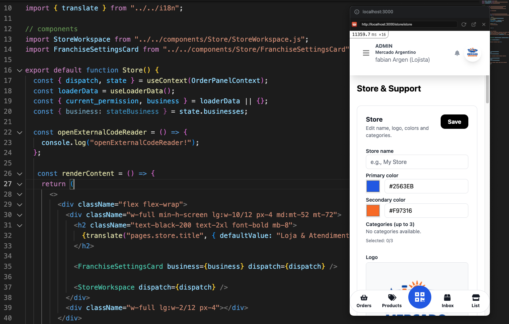
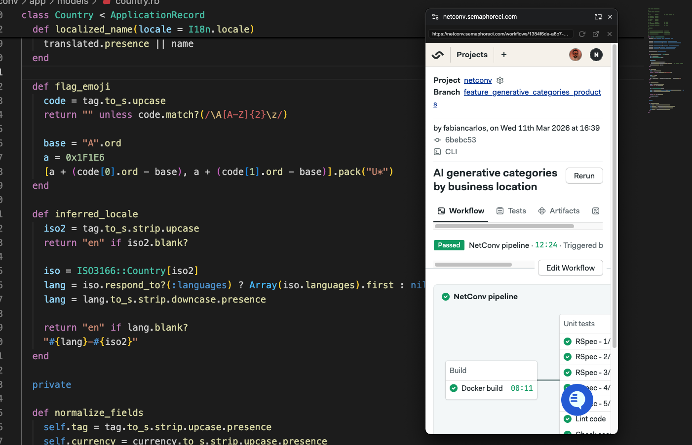
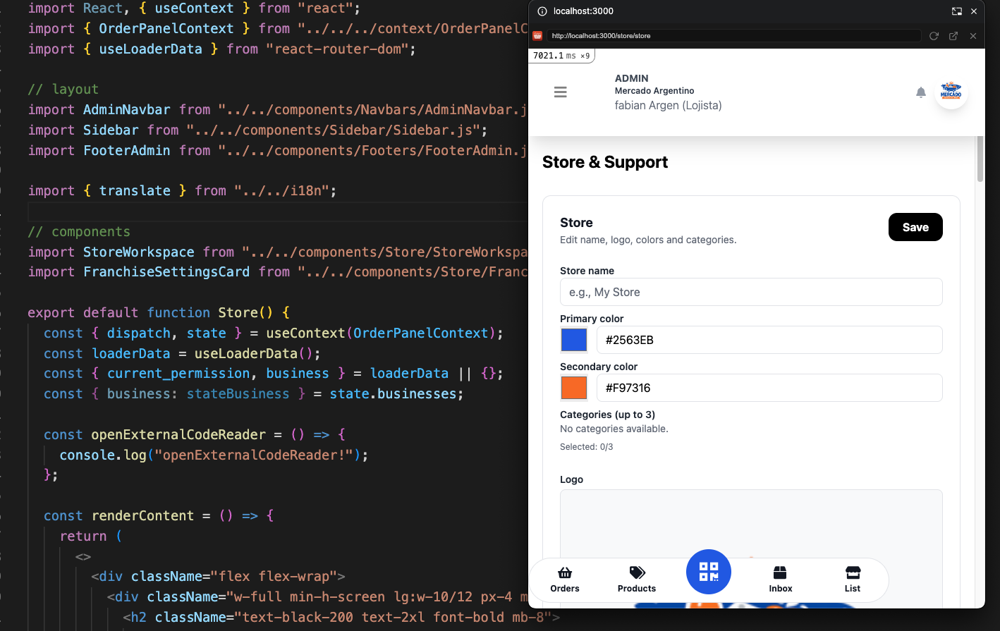

# Web to Picture

> A floating window for any web page — like Picture-in-Picture, but for the entire page.

**Web to Picture** opens the current tab in a floating Picture-in-Picture window that stays on top of every other application on your screen. The window renders the page in a mobile-vertical format (responsive layout), and you can resize it freely.

---

## Use Cases

### 1. Watching a local dev server with hot reload

Keep your web app open in a floating window while you code. Every time you save a file, the hot reload reflects instantly in the PiP window — no need to switch tabs or alt-tab to the browser.

---

### 2. Monitoring a CI pipeline while fixing bugs

Trigger a CI run (GitHub Actions, Semaphore, CircleCI, etc.) and open the pipeline page in a floating window. You can watch the build progress in real time while working on fixes in your editor — the window stays on top no matter what you are doing.

---

### 3. Testing responsive / mobile layouts

Open any web page in a mobile-sized floating window (iPhone 390×844, Android 412×915, or Tablet 768×1024) to quickly evaluate how your layout behaves on smaller screens — no need for DevTools or a physical device.

---

## Features

- **Floating window** — stays above all other applications, just like video Picture-in-Picture
- **Mobile-first format** — opens in portrait orientation by default
- **Size presets** — iPhone, Android, Tablet
- **Custom size** — set any width × height you need
- **Toolbar** — reload, open in Chrome, close
- **Keyboard shortcut** — `Alt`+`Shift`+`P` to activate/deactivate instantly
- **Blocked site detection** — shows a fallback button when a site blocks iframes

---

## Installation (development)

1. Open `chrome://extensions` (Chrome) or `edge://extensions` (Edge)
2. Enable **Developer mode** (top-right toggle)
3. Click **Load unpacked**
4. Select the `web-to-picture/` folder

---

## Usage

1. Navigate to any web page
2. Click the **Web to Picture** icon in the browser toolbar
3. Choose a size preset or enter a custom width × height
4. Click **Open Web to Picture**
5. The page opens in a floating window — drag, resize, and keep working

**Keyboard shortcut:** `Alt`+`Shift`+`P`

---

## Browser compatibility

| Browser | Support | Notes |
|---|---|---|
| Chrome 116+ | ✅ Full | Uses Document Picture-in-Picture API |
| Edge 116+ | ✅ Full | Chromium-based, same API |
| Firefox | ⚠️ Partial | Requires `documentPictureInPicture` API — not yet available in stable; uses fallback window |
| Safari | ❌ | API not supported |

---

## License

MIT License — see [LICENSE](LICENSE) for details.

---

## Contributing

Pull requests are welcome. For major changes, please open an issue first to discuss what you would like to change.
